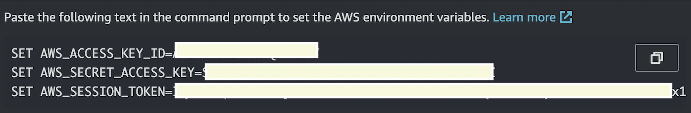
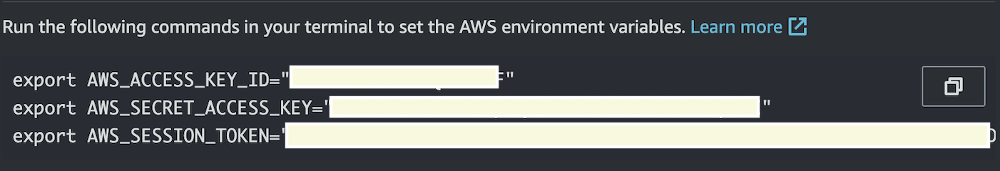

## Run Locally  
To run the application locally you need to start the backend application then the front end.  First, you need to refresh your AWS credentials.  

*Prerequisite* - you must have an entry in your hosts file like so:
>127.0.0.1 local.csweb.repsrv.com

## Step 1:
Refresh your AWS credentials locally.  Login to the AWS console and copy the Access Keys:

*Windows*  

*Mac OS*  
  

Copy the three SET/EXPORT commands and paste in a local terminal shell (the same one you will be running the backend in)  

## Step 2: 
Start the backend

Run these command in the same terminal as step 1:  
**** NOTE: the example below reads property configs from AWS env 'dev1'   

MacOS
> export CSWEB_ENV=dev1 && export CSWEB_REGION=us-east-2

Windows
> set "CSWEB_ENV=dev1" && set "CSWEB_REGION=us-east-2"   

> mvn clean install tomcat7:run

## Step 3:
Start the front end

Run this command in a new terminal making sure PWD you are in is the front end module:
> ng serve --open --configuration=local --host local.csweb.repsrv.com --base-href /

  
  
## AWS Secrets and Parameters
CBS and InfoPro as400 connection username and passwords are stored in AWS Secrets Manager.  All other configurations are stored in Parameter Store.

### Secrets Manager Naming
All secrets are stored under the secret name`/secret/{environment}/csweb2/` where the environment value is one of `devN|testN|prod`

### Parameter Store Naming
All parameter store values are prefixed with `/config/{environment}/csweb2/`

For example `config/dev/csweb2/health/check` is the parameter name for the health check value `success`

To have Spring inject these values into a Java bean using annotations, use the `@Value()` annotation.  
So, to inject the `health.check` value into a bean we would use `@Value("${health.check}")`

### Notice  

1.  we don't use slashes on the Java side, they get converted to periods  
2.  we don't use the prefixes on the Java side**_.

_(*** note that the value 'csweb2' is configured in the aws-config.xml file under the id `configPrefix`)_